# 📊lightweight-charts-python **v3.0** 🚀

# [MIT License](LICENSE)

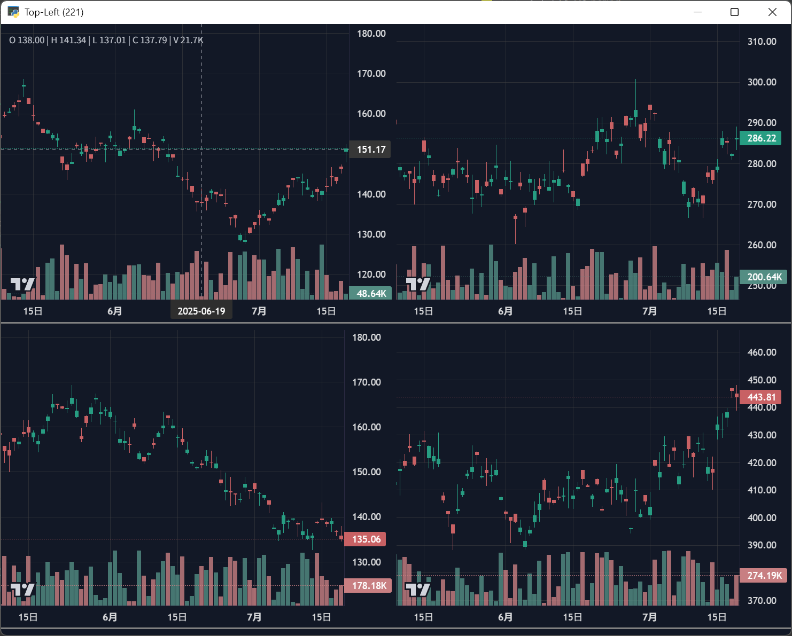
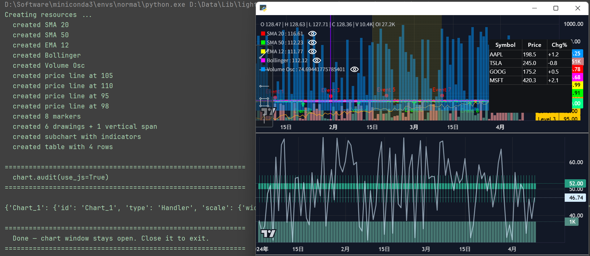

**lightweight-charts-python v3.0** — 基于原作者 v2.1 的**特化维护版本**，大幅扩展功能。

> 原版 v2.1 由原作者维护，此后由我接手进行深度定制和功能增强。  
> 从接手时的 **v2.5.1** 到 **v3.0**，经历了 **15 个子版本迭代**、**21 天密集开发**，核心功能覆盖率达 **~85%**。

> ✅ 7 种 Series 类型 · TimeScaleApi · PriceScaleApi · 40 个示例 · 8 个测试套件  
> 📖 [迁移指南 v2.5→v3.0](MIGRATION_v2.5_to_v3.0.md) | [快查文档](QUICK_REFERENCE.md) | [更新日志](CHANGELOG.md)

English Version ReadMe: [README_EN.md](README_EN.md)

---

# 🛠️尝试继续维护
本人对 TypeScript 了解比较少，主要依赖 DeepSeek AI 辅助维护  
比对了大量的K线绘制库，发现 lightweight-charts-python 唯一功能足够全，性能足够强，易于嵌入QtUI的库，并且存在刚需的功能，遂尝试继续维护  

当前已基本排除完bug，examples 全部例子已在windows测试通过  
lightweight-chart 主库已更新到 v5.2.0，并添加了一部分v5的新功能  

我的主要使用环境为 windows + python 3.13 + PySide6 + WebView，其他环境上面可能有问题。  

---

# 🫡其他活跃的同类储存库，各有特别的新功能，值得尝试，我也参考了它们的代码

https://github.com/gopalparashar421/lightweight-charts-python  
https://github.com/smalinin/bn_lightweight-charts-python  
https://github.com/EsIstJosh/lightweight-charts-python  

---

## 🚀 相比原版 v2.1 的新功能 / 变更 / 增强

> 以下列出本特化版本相对原作者 v2.1 的全部新增和变更内容。

### 🔄 架构变更

| 变更 | 原版 v2.1 | 本版 v3.0 | 说明 |
|------|-----------|-----------|------|
| 组合架构 | CandleSeries 附属 volume/OI | Volume/OI 独立化 + AbstractChart 组合管理 | reset 后自动重建，常驻存在 |
| 系列管理 | `candle.attach_volume()` | `chart.volume` / `chart.oi` 自动管理 | 设置即用，无需手动挂载 |
| 统一输入 | 各系列列名不统一 | 统一 `time` + `value` 列 | 列名标准化 |
| normal_df | 自动小写 + date→time | 不再自动转换 | 列名必须精确匹配 |
| sync 同步 | `sync=chart.id` 配对同步 | `sync_id='组名'` 组同步 | 主图也能参与同步 |
| `_lines` 联动 | chart.set() 自动填充 line | chart.set() 不再联动 _lines | 需手动 `line.set(df)` |

### 📝 API 重命名

| 原版 v2.1 | 本版 v3.0 | 说明 |
|-----------|-----------|------|
| `marker()` | `add_marker()` | 添加单条标记 |
| `markers()` | `add_markers()` | 批量添加标记 |
| `markers`（方法名） | `markers`（列表属性） | 用 `chart.markers` 查看标记列表 |
| `update()` | `update_bar()` | K 线单条更新 |
| `update_from_tick()` | `update_tick()` | Tick 单条更新 |
| `update_from_ticks()` | `update_ticks()` | Tick 批量更新 |
| `Line` / `Histogram` 类 | `LineSeries` / `HistogramSeries` | 统一 `XxxSeries` 命名 |
| `toolbox.save_drawings_under()` | `toolbox.on_change += func` | 回调注册方式 |
| `price_scale(perm_width=N)` | 已移除 | 无替代 |

### ✨ 新增功能

#### 新增 Series 类型
- **AreaSeries** — 面积图（折线+渐变填充）
- **OHLCBarSeries** — 美国线（横向 OHLC 柱状图）
- **BaselineSeries** — 基准线（以基准值为界上下分色）
- **CandleSeries** — 独立 K 线系列（任意 pane，无 volume/OI）

#### 新增 API
- **TimeScaleApi** — `chart.time_scale_api()` 时间轴完整控制（14 方法）
- **PriceScaleApi** — `chart.price_scale_api(scale_id)` 价格轴完整控制（6 方法）
- **`build_price_scale_options()`** — snake_case→JS 驼峰纯函数
- **`chart.fit()` / `chart.set_visible_range()`** — 视图控制
- **`chart.show(wait=N)`** — 计时自动关闭窗口
- **`chart.chart_options()`** — 图表级高级选项

#### 新增图表类型
- **HtmlTabChart** — 多策略 Tab 切换，init 快照重放
- **CrossProcessChart** — 跨进程嵌入 Qt（Windows + Linux/X11）
- **ReflexChart** — Reflex 框架嵌入
- **HTMLChart / JupyterChart / StreamlitChart / QtChart / WxChart** — 多种嵌入方式

#### 绘图系统增强
- **ToolBox 跨 Pane 绘图** — 鼠标点击自动识别目标 pane
- **Pane Primitive 架构** — Drawing 直接附着到 pane，不依赖 series 数据
- **ToolBox on_change 回调** — `+=` / `-=` 注册/卸载多回调
- **DrawingInfo 增强** — 新增 pane_index/time/price 字段
- **Legend OHLC 支持** — Bar/Candlestick 显示 O H L C
- **Legend 分组** — 组开关一键切换可见性

#### 批量 & 性能
- **`update_bars(df)`** — 批量 OHLCV 增量更新（JS 命令合并发送）
- **`update_ticks(df)`** — 批量 Tick 增量更新
- **`update_bars()` 用于 Line/Histogram** — 序列批量更新
- **消息循环异常保护** — 不会因为单条消息失败而终止

#### 其他增强
- **Histogram 任意颜色** — 每根柱子独立着色（`color` 列）
- **reset_sub()** — 子图内容重置，保留布局
- **网格布局系统** — `position` 参数三种格式，类似 matplotlib subplot
- **运行时位置控制** — `get_position()` / `set_position()`
- **`sync_id` 组同步** — 替代旧配对同步
- **8 个测试套件** — 全面覆盖资源清理 / 功能 / 数据聚合 / 位置解析等
- **40 个示例** — 从基础到高级跨 Pane 绘图
- **精细资源回收** — 长时间运行几乎无内存泄露
- **`_remove_my_handlers()`** — 精确清除 handler，避免多图表误杀

> 🧰 **主要支持环境** — PySide6、PyQt6、wxPython

---

## ⚠️ 破坏性更改：v2.5.1 → v3.0

> v3.0 是 lightweight-charts-python 的第一个正式大版本，所有 Breaking Changes 已合并为一份清单。  
> 详细迁移步骤见 [MIGRATION_v2.5_to_v3.0.md](MIGRATION_v2.5_to_v3.0.md)，包含逐项对照和验证清单。

### 同步机制：`sync=chart.id` → `sync_id='组名'`

```python
# ❌ 旧写法 — 链式传递 chart.id，配对同步
chart = Chart(...)
sub = chart.create_subchart(sync=chart.id)

# ✅ 新写法 — 组名同步，主图也参与
chart = Chart(..., sync_id='main')
sub = chart.create_subchart(sync_id='main')
```

### 函数重命名

| 旧名称 | 新名称 |
|--------|--------|
| `update_from_tick()` | `update_tick()` |
| `update_from_ticks()` | `update_ticks()` |
| `update()` / `update_bar()` | 统一 `update_bar()` / `update_bars()` |
| `marker()` | `add_marker()` |
| `markers()` | `add_markers()` |
| `markers`（方法） | `markers`（列表属性） |
| `Line` / `Histogram` 类 | `LineSeries` / `HistogramSeries` |

### 类重命名

| 旧名称 | 新名称 |
|--------|--------|
| `Line` | `LineSeries` |
| `Histogram` | `HistogramSeries` |

工厂方法 `create_line()` / `create_histogram()` 名称不变，返回类型变为 `LineSeries` / `HistogramSeries`。

### AbstractChart 不再联动设置 _lines

`chart.set(df)` / `chart.update_bars(df)` / `chart.update_ticks(df)` **不再自动转发数据给 Line/Histogram 系列**，需手动 `line.set(df)`。

### normal_df 移除小写转换和 date 列支持

列名**必须精确匹配**小写格式（`time`, `open`, `high`, `low`, `close`, `value`），不再自动转换。

```python
# ❌ 旧写法 — 依赖自动转换
df = pd.DataFrame({'Date': dates, 'Open': ..., 'Close': ...})
chart.set(df)  # 自动转小写

# ✅ 新写法 — 列名必须精确
df = pd.read_csv('data.csv').rename(columns={'date': 'time'})
chart.set(df)
```

### VolumeSeries / OpenInterestSeries 统一使用 value 列

独立创建时使用 `value` 列（不再用 `volume` / `open_interest` 列名）。通过 chart 调用时自动转发，无感知。

### 参数移除

| 参数 | 说明 |
|------|------|
| `price_scale(perm_width=N)` | 已移除，无替代 |
| `cumulative_volume` | 已移除，VolumeSeries 始终自动求和 |
| `toolbox.save_drawings_under()` | 改为 `toolbox.on_change += func` |
| `toolbox.load_drawings()` / `import_drawings()` / `export_drawings()` | 已移除，用 `on_change` 自行实现 |

---


# 🤖建议让 AI编程助手 先阅读 QUICK_REFERENCE.md 文件，快速了解全项目

---

# 使用PYPI安装

```bash
pip install lightweight-charts-onesixth
```

# 使用源码安装

```bash
pip install https://github.com/One-sixth/lightweight-charts-python
```

# 构建

构建本包，需要安装有 node.js 环境，需要调用 npm 命令

先构建 JS bundle 库。

### 下载node包的依赖
```
npm install @rollup/plugin-typescript --save-dev
npm audit fix --force
```

### 构建和复制成品到python源码目录
```
npx rollup -c rollup.config.js
cp dist/bundle.js lightweight_charts/js/bundle.js
```

### 构建 whl 包
```
python -m build
```

构建完成的whl包在dist目录中

---


## 核心 API 速查

| 方法 | 说明 |
|------|------|
| `chart.set(df)` | 设置 K线数据 |
| `chart.update_bar(series)` | 更新最后一根 K线 |
| `chart.update_tick(series)` | 从逐笔成交更新 K线 |
| `chart.add_marker(time, ...)` | 添加价格标记 |
| `chart.marker_auto_scale(enable)` | 控制标记是否参与价格轴缩放 |
| `chart.pop(count)` | 从末尾移除 N 个数据点 |
| `chart.create_line(name, ...)` | 创建折线指标（返回 LineSeries） |
| `chart.create_histogram(name, ...)` | 创建柱状图指标（返回 HistogramSeries） |
| `chart.create_area_series(name, ...)` | 创建面积图 |
| `chart.create_ohlc_bar_series(name, ...)` | 创建美国线 |
| `chart.create_baseline_series(name, ...)` | 创建基准线 |
| `chart.create_subchart(...)` | 创建子面板 |
| `chart.create_price_line(price, ...)` | 创建价格线 |
| `chart.horizontal_line(price, ...)` | 创建水平线 |
| `chart.vertical_span(start, end, ...)` | 创建垂直高亮区间 |
| `chart.get_position()` | 获取图表渲染位置 (x, y, width, height) 百分比 |
| `chart.set_position(x, y, width, height)` | 动态设置图表渲染位置 |
| `chart.audit(use_js=False)` | 资源审计（Python 侧） |
| `chart.audit(use_js=True)` | 资源审计（JS 侧，TOML 格式） |
| `chart.reset()` | 重置图表到初始状态 |
| `chart.screenshot(...)` | 截图（支持 add_top_layer 和 include_crosshair） |
| `chart.price_scale(price_format=...)` | 配置价格坐标轴 |
| `chart.time_scale_api()` | 时间轴 API（滚动/范围/事件订阅） |
| `chart.price_scale_api(scale_id)` | 价格轴 API（选项/范围/尺寸） |

---

## 🎯 高级 API：TimeScaleApi & PriceScaleApi

基础功能（配置、数据设置）使用上面的 Python 函数即可。  
如需**事件回调**或**更精细的控制**，请使用以下 API：

```python
# 时间轴 API
chart.time_scale_api().scroll_to_real_time()
chart.time_scale_api().subscribe_visible_logical_range_change(handler)

# 价格轴 API（默认右侧）
chart.price_scale_api().width()
chart.price_scale_api().set_auto_scale(True)

# 价格轴 API（指定左侧）
chart.price_scale_api('left').apply_options(scale_margin_top=0.1)
```

| API | 方法 | 说明 |
|-----|------|------|
| **TimeScaleApi** | `scroll_position()` | 获取滚动位置 |
| | `scroll_to_position(pos)` | 滚动到指定位置 |
| | `scroll_to_real_time()` | 滚动到实时数据 |
| | `fit_content()` | 数据适应视口 |
| | `get_visible_range()` | 获取可见范围 |
| | `set_visible_range(range)` | 设置可见范围 |
| | `width()` | 获取宽度 |
| | `subscribe_visible_logical_range_change(handler)` | **订阅逻辑范围变化** |
| | `subscribe_visible_time_range_change(handler)` | **订阅时间范围变化** |
| | `subscribe_size_change(handler)` | **订阅尺寸变化** |
| **PriceScaleApi** | `apply_options(**kwargs)` | 应用选项 |
| | `options()` | 获取选项 |
| | `width()` | 获取宽度 |
| | `set_auto_scale(on)` | 设置自动缩放 |

> 📖 详见 [QUICK_REFERENCE.md](QUICK_REFERENCE.md) 的 3.8.1 和 3.8.2 章节

---

## 文档与支持

建议通过 examples 例子来学习，ReadMe 下方有大量参考代码和画廊  
若要了解全部功能，可以阅读 QUICK_REFERENCE.md 文件，我尽量让它包含了所有功能的详细说明和示例代码  

---

**免责声明：** 本包为独立开发，未经 TradingView 背书、赞助或批准。作者与 TradingView 无任何官方关系，本包不代表 TradingView 的观点或立场。

---

## 完整示例目录

| 序号 | 示例名称 | 功能说明 |
|------|----------|----------|
| 1 | `1_setting_data` | 基础数据设置 |
| 2 | `2_live_data` | 实时 K线更新 |
| 3 | `3_tick_data` | Tick 数据更新 |
| 4 | `4_line_indicators` | 折线指标 SMA |
| 5 | `5_styling` | 样式定制 |
| 6 | `6_callbacks` | 回调事件 |
| 7 | `7_multi_pane` | 多面板图表 |
| 8 | `8_volume_open_interest` | 成交量+持仓量 |
| 9 | `9_multi_chart` | 多 Chart 实例 |
| 10 | `10_persistent_legend` | 常驻图例 |
| 11 | `11_vertical_span` | 垂直区间高亮 |
| 12 | `12_audit` | 资源审计 |
| 13 | `13_batch_update` | 批量更新 API |
| 14 | `14_set_period` | 时间周期锁定 |
| 15 | `15_pyside6_simple` | PySide6 集成 |
| 16 | `16_pyside6_race` | PySide6 性能测试 |
| 18 | `18_hovered_series_on_top` | 悬停系列置顶 |
| 19 | `19_timescale_options` | 时间轴选项 |
| 20 | `20_tick_mark_density` | 刻度密度控制 |
| 21 | `21_marker_auto_scale` | 标记自动缩放 |
| 22 | `22_pop` | 移除数据点 |
| 23 | `23_crosshair_move` | 十字光标事件 |
| 24 | `24_price_format` | 价格格式设置 |
| 25 | `25_screenshot_enhanced` | 增强截图 |
| 26 | `26_series_batch_update` | 序列批量更新 |
| 27 | `27_reflex_chart` | Reflex 集成 |
| 28 | `28_cross_process_chart` | 跨进程嵌入 Qt |
| 29 | `29_grid_layout` | 网格布局系统 |
| 30 | `30_table_component` | 表格组件（自选股/持仓管理） |
| 31 | `31_chart_sync` | 图表同步功能（时间轴+十字光标） |
| 32 | `32_html_tab_chart` | HtmlTabChart 多策略 Tab 切换 |
| 33 | `33_reset_sub` | reset_sub 子图内容重置 |
| 34 | `34_candle_series` | CandleSeries 独立K线系列 |
| 35 | `35_line_markers` | Line / Histogram 系列标记（marker） |
| 36 | `36_histogram_colors` | Histogram 任意颜色（per-bar 着色） |
| 37 | `37_more_series_types` | AreaSeries / OHLCBarSeries / BaselineSeries 新系列 |
| 38 | `38_drawing_multi_pane` | 跨 Pane 绘图：Drawing 在多个面板间分布 |
| 39 | `39_legend_group` | Legend 分组：组开关 + 个人眼睛切换 |
| 40 | `40_toolbox_multi_pane` | ToolBox 跨 Pane 绘图：3 pane 绘图工具箱 |

> **共 40 个示例**（v3.0）


## 示例截图展示

> **以下为所有示例的截图位置，可根据实际效果替换图片**

### 示例 1：显示 CSV 数据

```python
import pandas as pd
from lightweight_charts import Chart

if __name__ == '__main__':
    chart = Chart()
    df = pd.read_csv('ohlcv.csv')
    chart.set(df)
    chart.show(block=True)
```

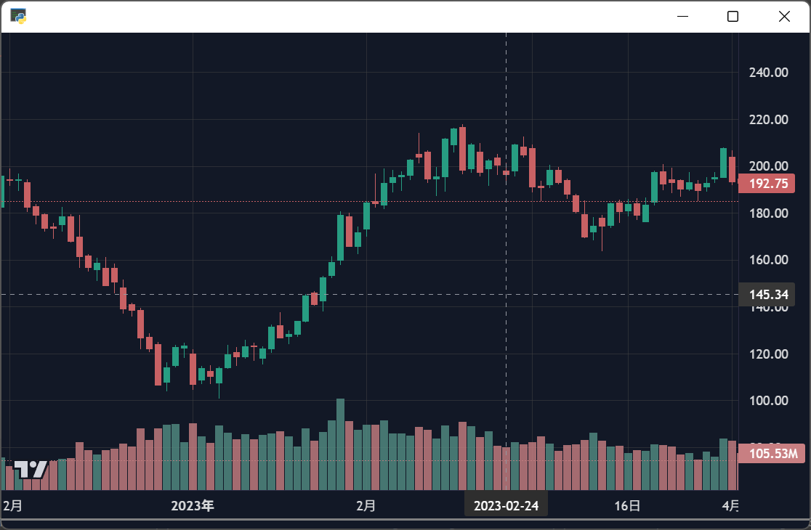

---

### 示例 2：实时更新 K线

```python
import pandas as pd
from time import sleep
from lightweight_charts import Chart

if __name__ == '__main__':
    chart = Chart()
    df1 = pd.read_csv('ohlcv.csv')
    df2 = pd.read_csv('next_ohlcv.csv')
    chart.set(df1)
    chart.show()
    for _, bar in df2.iterrows():
        chart.update_bar(bar)
        sleep(0.1)
```

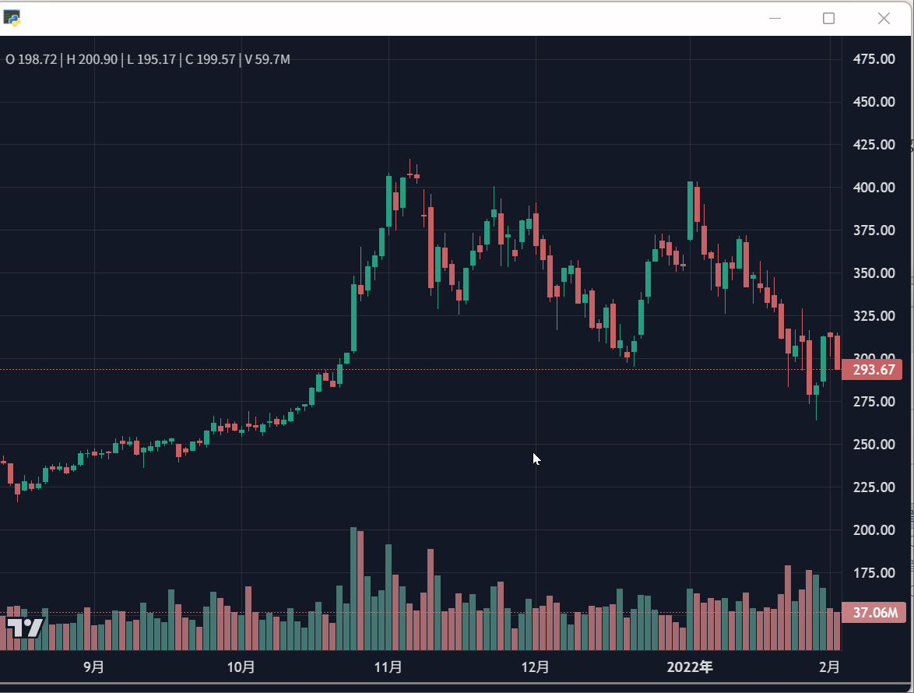

---

### 示例 3：从 Tick 数据更新

```python
import pandas as pd
from time import sleep
from lightweight_charts import Chart

if __name__ == '__main__':
    chart = Chart()
    chart.set(pd.read_csv('ohlc.csv'))
    chart.show()
    for _, tick in pd.read_csv('ticks.csv').iterrows():
        chart.update_tick(tick)
        sleep(0.03)
```

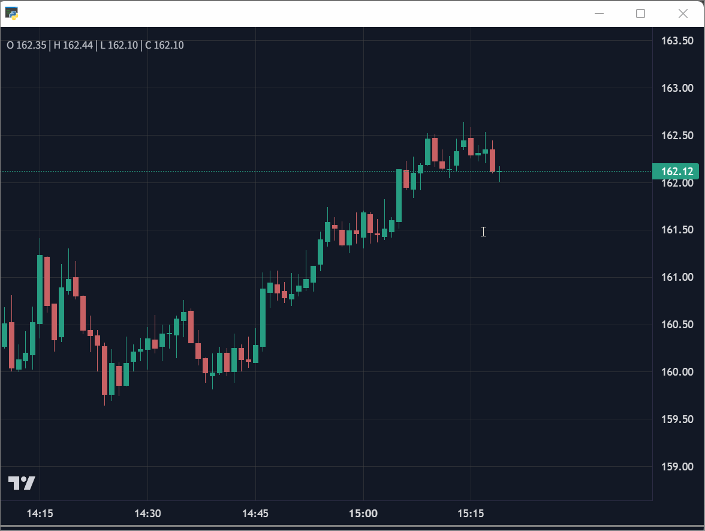

---

### 示例 4：折线指标（SMA）

```python
import pandas as pd
from lightweight_charts import Chart

def calculate_sma(df, period=50):
    return pd.DataFrame({
        'time': df['date'],
        f'SMA {period}': df['close'].rolling(period).mean()
    }).dropna()

if __name__ == '__main__':
    chart = Chart()
    df = pd.read_csv('ohlcv.csv')
    chart.set(df)
    line = chart.create_line('SMA 50')
    line.set(calculate_sma(df, 50))
    chart.show(block=True)
```

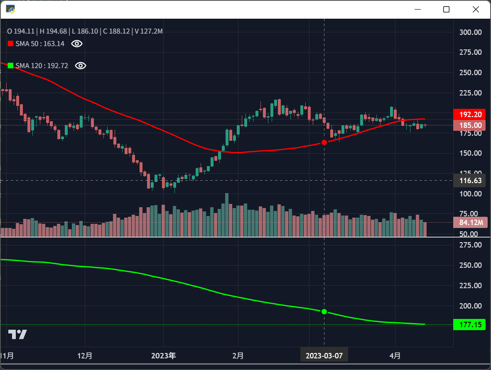

---

### 示例 5：样式定制

```python
import pandas as pd
from lightweight_charts import Chart

if __name__ == '__main__':
    chart = Chart()
    df = pd.read_csv('ohlcv.csv')
    chart.layout(background_color='#090008', text_color='#FFFFFF')
    chart.candle_style(up_color='#00ff55', down_color='#ed4807')
    chart.watermark('1D', color='rgba(180,180,240,0.7)')
    chart.set(df)
    chart.show(block=True)
```

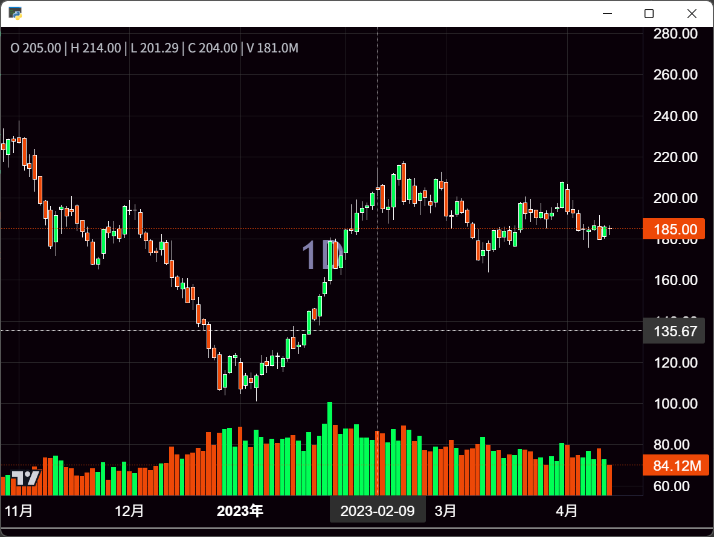

---

### 示例 6：回调事件

```python
import pandas as pd
from lightweight_charts import Chart

def on_search(chart, searched_string):
    new_data = get_bar_data(searched_string, chart.topbar['timeframe'].value)
    if not new_data.empty:
        chart.topbar['symbol'].set(searched_string)
        chart.set(new_data)

if __name__ == '__main__':
    chart = Chart(toolbox=True)
    chart.events.search += on_search
    chart.topbar.textbox('symbol', 'TSLA')
    chart.topbar.switcher('timeframe', ('1min', '5min', '30min'))
    chart.set(get_bar_data('TSLA', '5min'))
    chart.show(block=True)
```

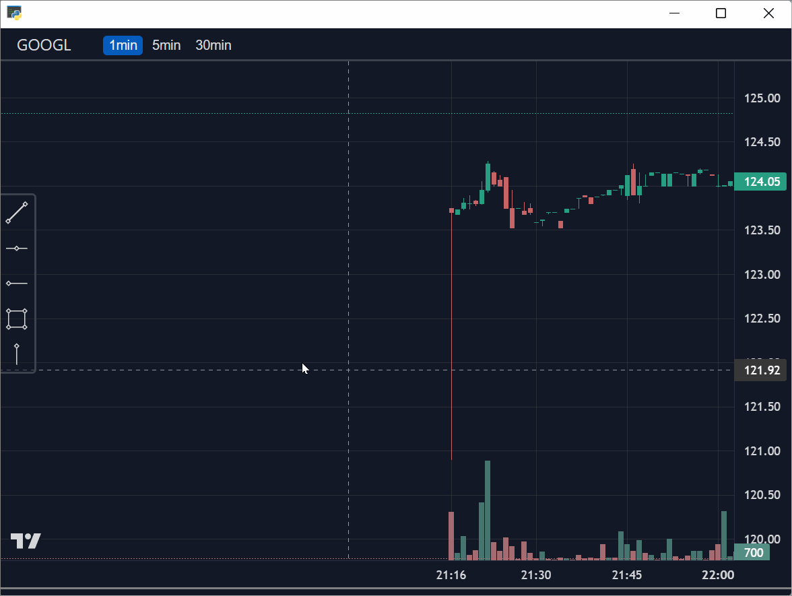

---

### 示例 7：多面板图表

```python
import pandas as pd
from lightweight_charts import HTMLChart

def demo():
    chart = HTMLChart(
        width=1200, height=800,
        position=111,                   # 图表位置 (网格格式)
        pane_index=0,                   # 面板索引
        marker_auto_scale=True          # 标记是否自动缩放
    )
    df = pd.read_csv('ohlcv.csv')
    chart.set(df)
    line7 = chart.create_line('SMA 7', color='red')
    line7.set(df[['date', 'close']].rename(columns={'close': 'SMA 7'}))
    chart.show()

if __name__ == '__main__':
    demo()
```

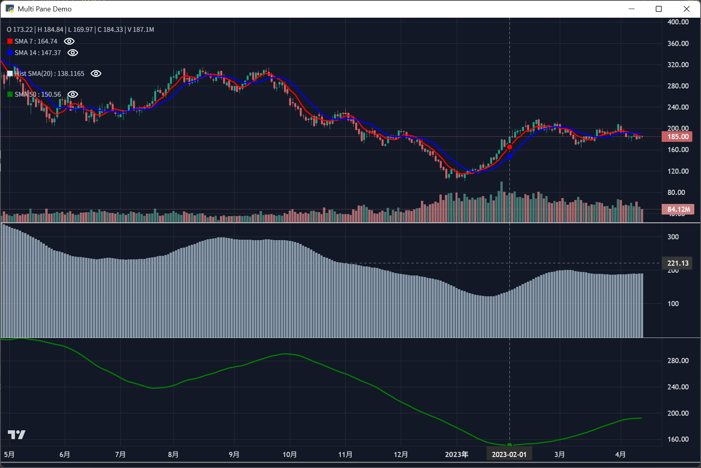

---

### 示例 8：成交量 + 持仓量

```python
import pandas as pd
from lightweight_charts import Chart

if __name__ == '__main__':
    chart = Chart(toolbox=True)
    df = generate_data()  # 包含 open_interest 列
    chart.set(df)
    chart.show(block=True)
```

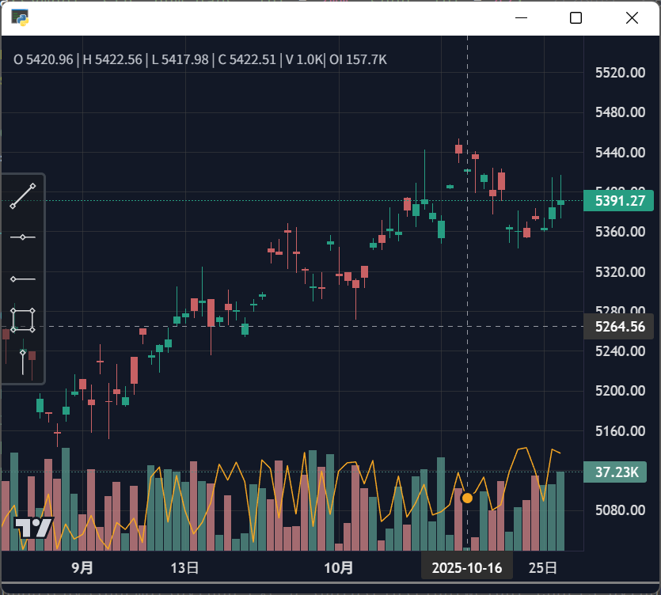

---

### 示例 9：多 Chart 实例

```python
import asyncio
from threading import Thread
from lightweight_charts import Chart

def run_chart(chart):
    asyncio.run(chart.show_async())

if __name__ == '__main__':
    chart1 = Chart(title='AAPL')
    chart2 = Chart(title='TSLA')
    chart1.set(df1)
    chart2.set(df2)
    t1 = Thread(target=run_chart, args=(chart1,), daemon=True)
    t2 = Thread(target=run_chart, args=(chart2,), daemon=True)
    t1.start()
    t2.start()
```

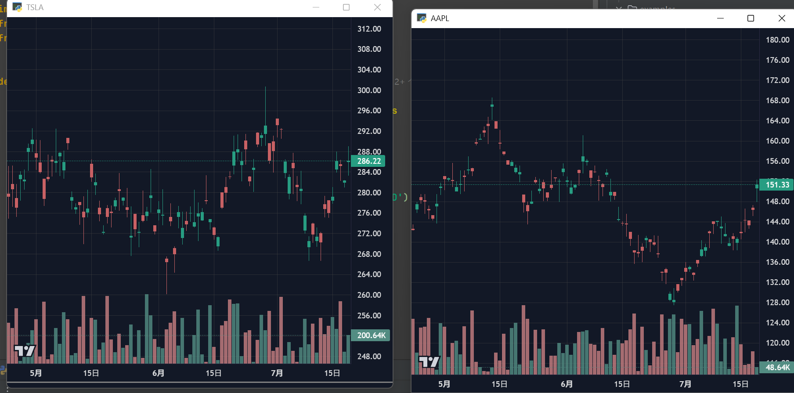

---

### 示例 10：常驻图例

```python
import pandas as pd
from lightweight_charts import Chart

if __name__ == '__main__':
    chart = Chart()
    df = generate_data()
    chart.legend(visible=True, ohlc=True, persistent=True)
    chart.set(df)
    chart.show(block=True)
```

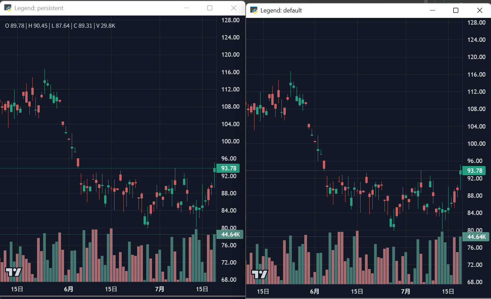

---

### 示例 11：垂直区间高亮

```python
import pandas as pd
from lightweight_charts import Chart

if __name__ == '__main__':
    chart = Chart()
    df = pd.read_csv('ohlcv.csv')
    chart.set(df)
    chart.vertical_span(start_time='2024-01-05', end_time='2024-06-10', color='rgba(252,219,3,0.15)')
    chart.show(block=True)
```

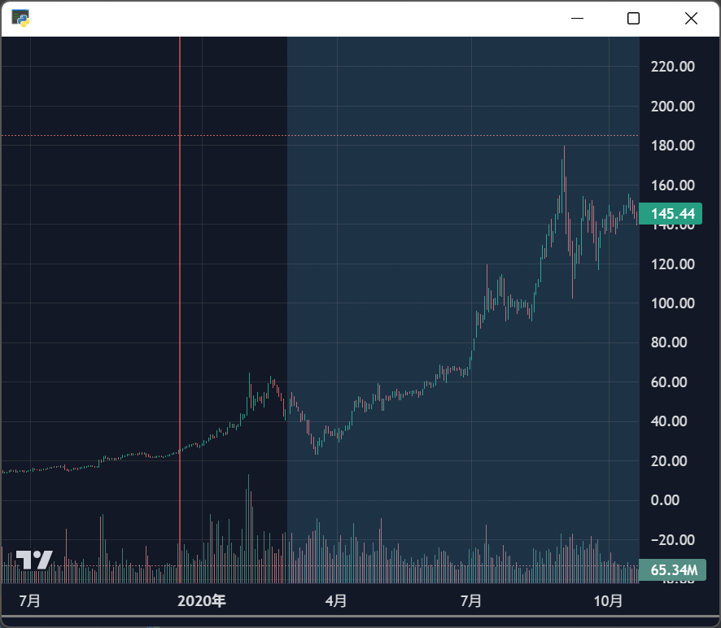

---

### 示例 12：资源审计

```python
from lightweight_charts import Chart

if __name__ == '__main__':
    chart = Chart(toolbox=True)
    chart.set(df)
    # 创建各种资源...
    result = chart.audit(use_js=True)  # JS侧状态检查
    print(result)
    chart.show(block=True)
```


---

### 示例 13：批量更新

```python
import pandas as pd
from lightweight_charts import Chart

if __name__ == '__main__':
    chart = Chart()
    chart.set(initial_df)
    chart.show()
    # 批量更新
    chart.update_bars(new_bars_df)
    chart.update_ticks(ticks_df)
```

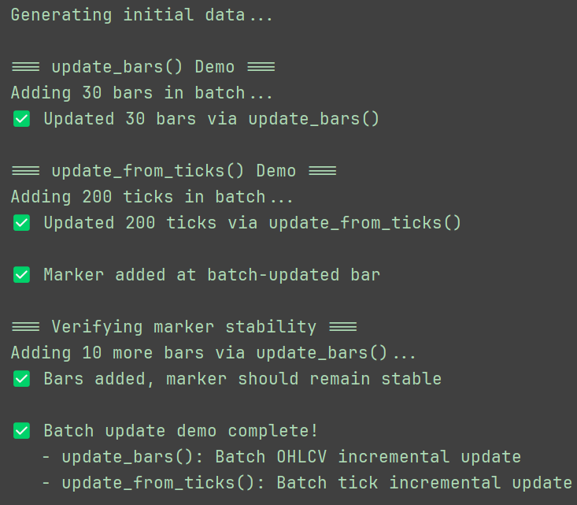

---

### 示例 14：时间周期锁定

```python
import pandas as pd
from lightweight_charts import Chart

if __name__ == '__main__':
    chart = Chart()
    chart.set(df_5min)
    chart.set_period(3600)  # 锁定为1小时
    chart.set(df_30min)  # 重要：set_period 后需重新 set() 使其生效，仍按1小时显示
    chart.show(block=True)
```

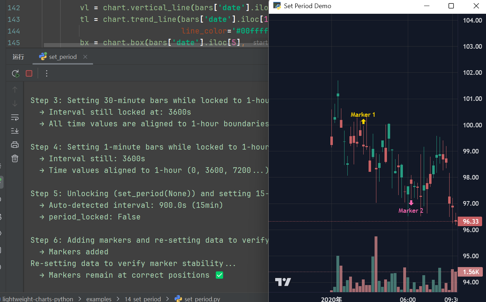

---

### 示例 15：PySide6 集成

```python
import sys
from PySide6.QtWidgets import QMainWindow, QVBoxLayout, QWidget
from lightweight_charts.widgets import QtChart

class MainWindow(QMainWindow):
    def __init__(self):
        super().__init__()
        self.chart = QtChart()
        layout = QVBoxLayout()
        layout.addWidget(self.chart.get_webview())
        self.chart.set(df)

if __name__ == '__main__':
    app = QApplication(sys.argv)
    window = MainWindow()
    window.show()
    sys.exit(app.exec())
```

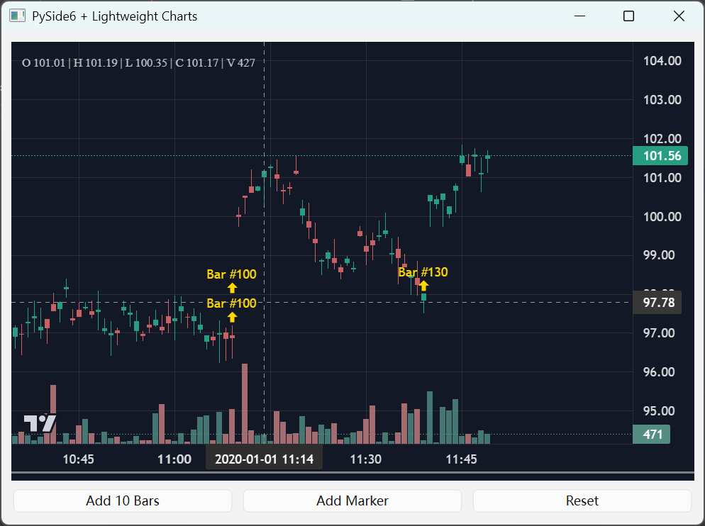

---

### 示例 16：PySide6 性能测试

```python
import sys
from PySide6.QtWidgets import QMainWindow
from lightweight_charts.widgets import QtChart

class SpeedRaceWindow(QMainWindow):
    def run_batch_race(self):
        start = time.perf_counter()
        self.chart.update_bars(new_bars)
        elapsed = time.perf_counter() - start
        print(f'update_bars: {elapsed:.4f}s')
```

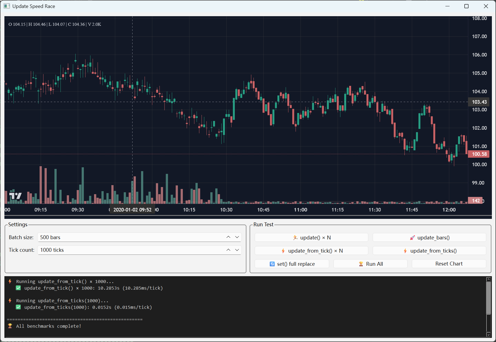

---

### 示例 18：悬停系列置顶

```python
from lightweight_charts import Chart

if __name__ == '__main__':
    chart = Chart()
    chart.chart_options(hovered_series_on_top=True)  # v5.2.0+
    chart.set(df)
    chart.show(block=True)
```

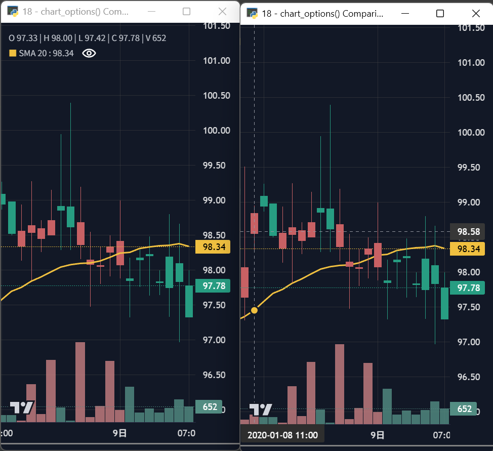

---

### 示例 19：时间轴选项

```python
from lightweight_charts import Chart

if __name__ == '__main__':
    chart = Chart()
    chart.time_scale(
        right_offset_pixels=50,
        enable_conflation=True,
        precompute_conflation_on_init=True
    )
    chart.set(large_df)
    chart.show(block=True)
```

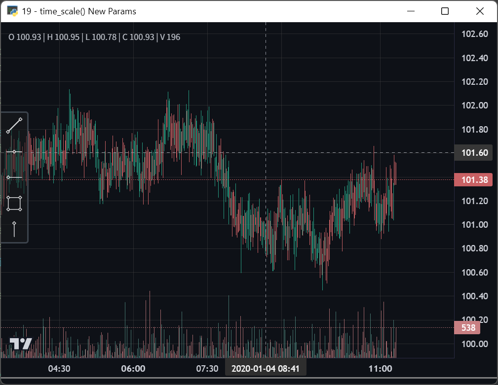

---

### 示例 20：刻度密度控制

```python
from lightweight_charts import Chart

if __name__ == '__main__':
    chart = Chart()
    chart.price_scale(tick_mark_density=2.5)  # v5.2.0+
    chart.set(df)
    chart.show(block=True)
```

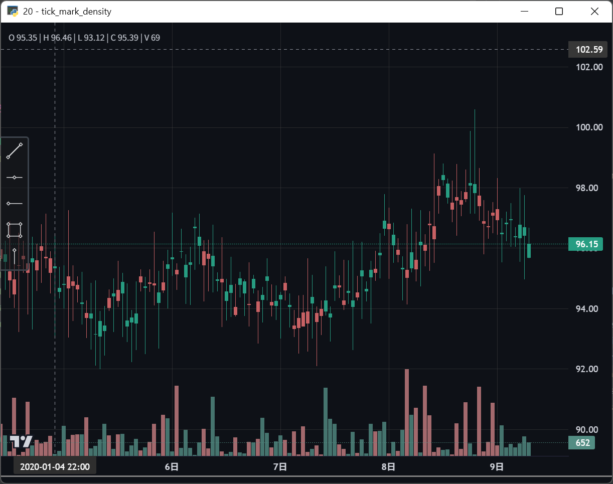

---

### 示例 21：标记自动缩放

```python
from lightweight_charts import Chart

if __name__ == '__main__':
    chart = Chart(marker_auto_scale=False)
    chart.set(df)
    chart.add_marker(time='2024-01-15', position='above', text='Event')
    chart.show(block=True)
```

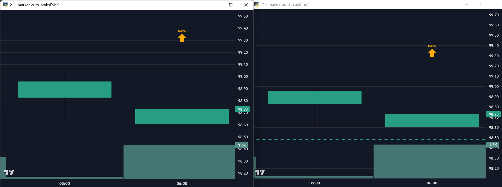

---

### 示例 22：移除数据点

```python
from lightweight_charts import Chart

if __name__ == '__main__':
    chart = Chart()
    chart.set(df)
    chart.pop(50)  # 移除最后50个数据点
    chart.show(block=True)
```

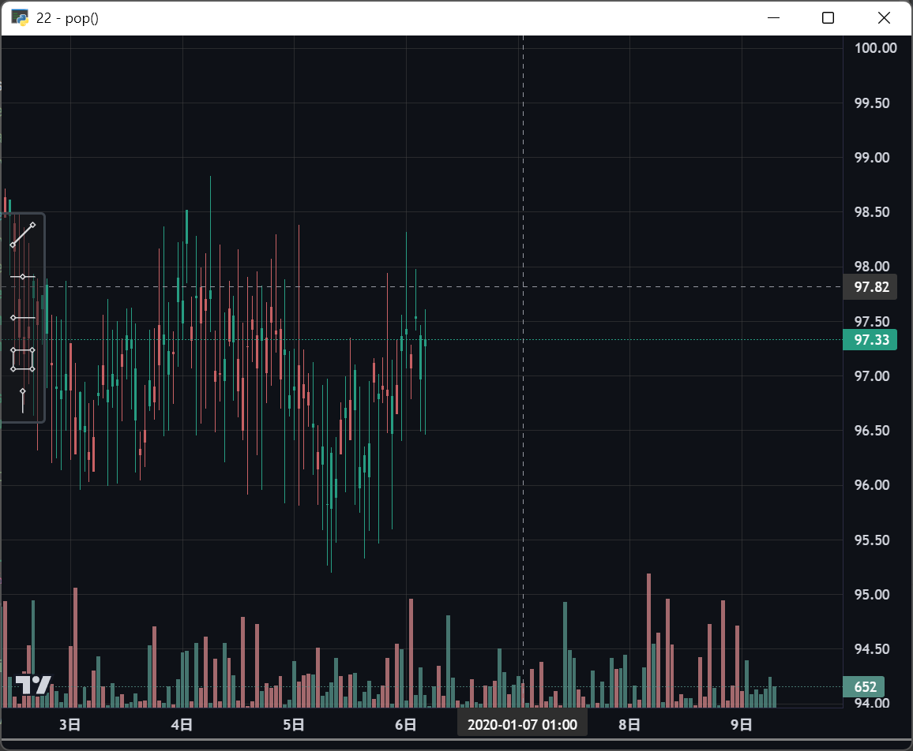

---

### 示例 23：十字光标事件

```python
def on_crosshair_move(chart, payload):
    dt = pd.to_datetime(payload['time'], unit='s')
    print(f'{dt} | price = {payload.get("price")}')

if __name__ == '__main__':
    chart = Chart()
    chart.events.crosshair_move += on_crosshair_move
    chart.set(df)
    chart.show(block=True)
```

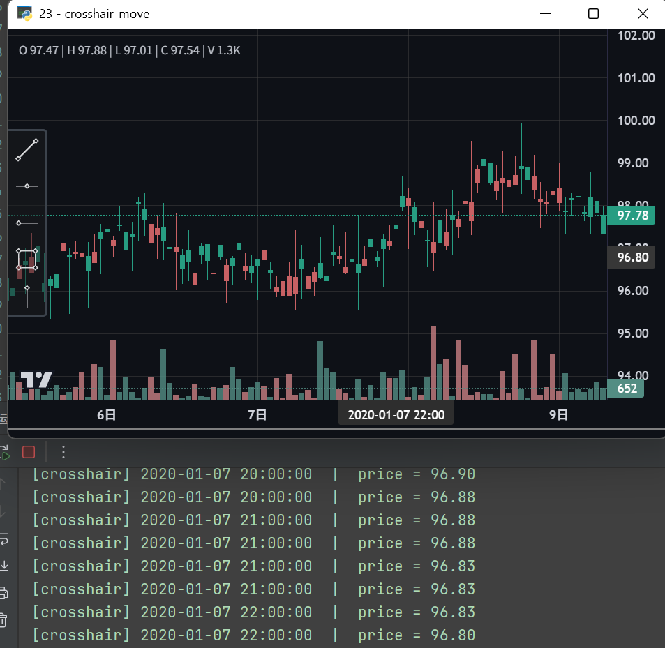

---

### 示例 24：价格格式设置

```python
from lightweight_charts import Chart

if __name__ == '__main__':
    chart = Chart()
    chart.set(df)
    chart.price_scale(price_format={'type': 'base', 'base': 100, 'precision': 2})
    chart.show(block=True)
```

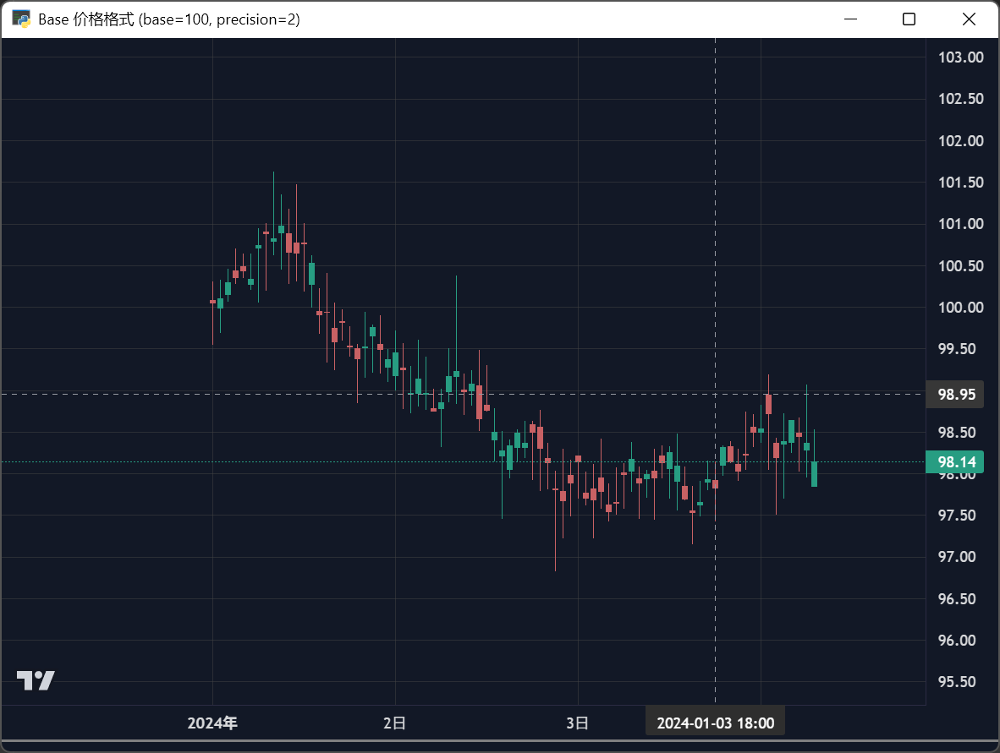

---

### 示例 25：增强截图

```python
from lightweight_charts import Chart
import time

if __name__ == '__main__':
    chart = Chart()
    chart.set(df)
    chart.watermark('截图演示')
    chart.show(block=False)
    time.sleep(2)
    img = chart.screenshot(add_top_layer=True, include_crosshair=True)
    with open('screenshot.png', 'wb') as f:
        f.write(img)
```

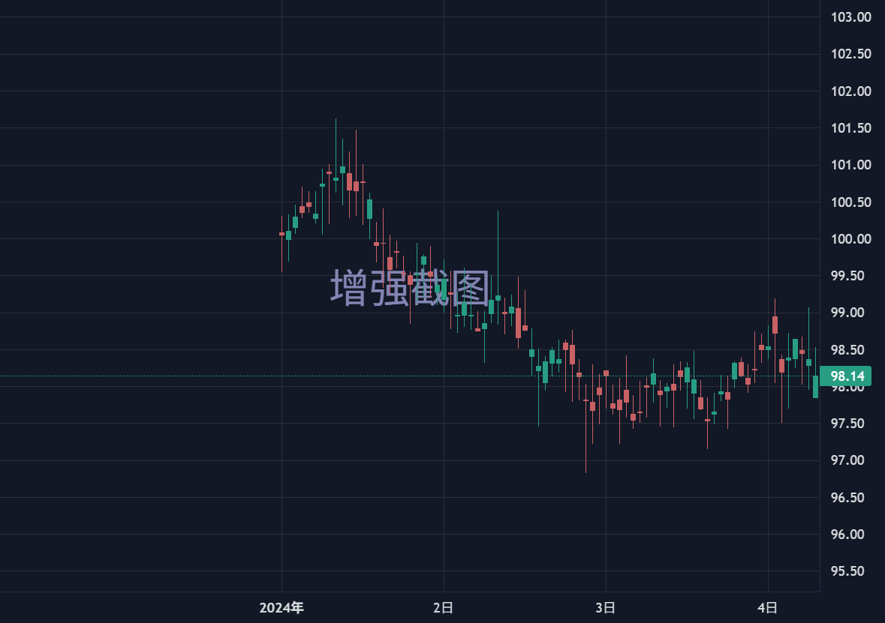

---

### 示例 26：序列批量更新

```python
from lightweight_charts import Chart

if __name__ == '__main__':
    chart = Chart()
    chart.set(df)
    line = chart.create_line('SMA 20')
    line.update_bars(sma_data)  # 批量更新序列
    chart.show(block=True)
```

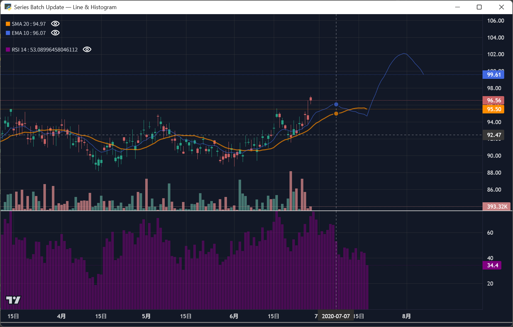

---

### 示例 27：Reflex 集成

```python
import reflex as rx
from lightweight_charts import ReflexChart

chart = ReflexChart(width=1000, height=600, auto_flush=True)
chart.set(pd.read_csv('ohlcv.csv'))

class ChartState(rx.State):
    def tick(self):
        chart.update(_next_bar())
        return chart.flush()
```

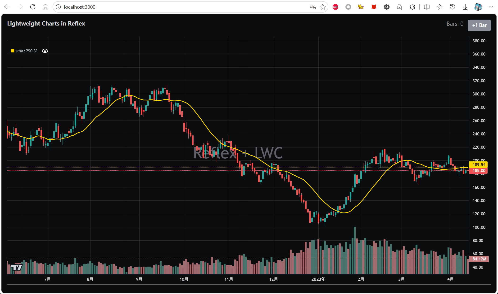

---

### 示例 28：跨进程嵌入 Qt

```python
from PySide6.QtWidgets import QMainWindow
from lightweight_charts import CrossProcessChart

class MainWindow(QMainWindow):
    def __init__(self):
        self.chart = CrossProcessChart(parent=self, width=800, height=500)
        self.chart.set(df)
```

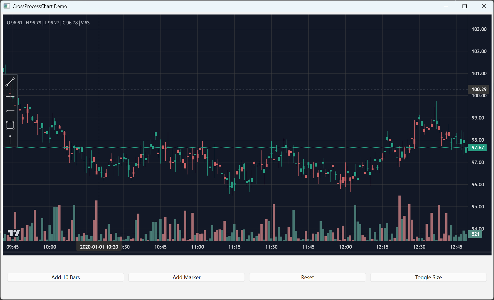

---

### 示例 29：网格布局

```python
from lightweight_charts import Chart

if __name__ == '__main__':
    chart1 = Chart(position=221)  # 2行2列第1个
    chart2 = chart1.create_subchart(position=222)
    chart3 = chart1.create_subchart(position=223)
    chart4 = chart1.create_subchart(position=224)
    chart1.set(df)
    chart1.show(block=True)
```


---

### 示例 30：表格组件

```python
from lightweight_charts import Chart

if __name__ == '__main__':
    chart = Chart(width=1000, height=600)
    chart.set(df)
    
    # 创建自选股表格
    watchlist = chart.create_table(
        width=0.22,
        height=0.4,
        headings=('Symbol', 'Price', 'Chg%', 'Volume'),
        widths=(0.35, 0.25, 0.2, 0.2),
        alignments=('left', 'right', 'right', 'right'),
        position=(0.02, 0.1),  # 使用相对坐标 (x, y)，范围 0-1
        draggable=True,
        func=on_watchlist_click
    )
    
    # 添加数据
    watchlist.new_row('AAPL', '198.50', '+1.2%', '12.5M')
    watchlist.new_row('GOOGL', '141.80', '-0.8%', '8.2M')
    watchlist.new_row('MSFT', '420.30', '+2.1%', '15.8M')
    
    # 设置样式
    watchlist.header(color='rgba(70, 130, 180, 0.8)', text_color='#FFFFFF')
    watchlist.rows[0].background_color('rgba(0, 255, 0, 0.1)')
    
    chart.show(block=True)
```

**position 参数说明：**

| 格式 | 示例 | 说明 |
|------|------|------|
| 元组 (x, y) | `(0.02, 0.1)` | 推荐：相对坐标，范围 0-1 |
| 元组 (x, y) | `(100, 50)` | 像素坐标，值 >= 1 时视为像素 |
| 字符串（已废弃） | `'left'`, `'right'` | 不推荐，会触发 DeprecationWarning，等效于 `(0, 0)` |

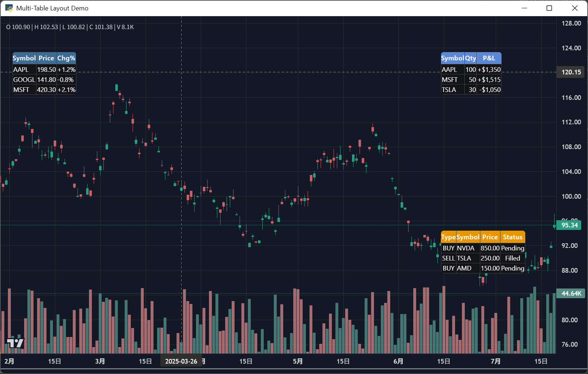

---

### 示例 31：图表同步

```python
from lightweight_charts import Chart

if __name__ == '__main__':
    # 创建主图表 - 使用 2x2 网格布局
    chart = Chart(width=1200, height=800, title='Chart Sync Demo', position=(2, 2, 1))
    
    # 创建右侧子图表（完全同步时间轴和十字光标）
    subchart_right = chart.create_subchart(
        position=(2, 2, 2),
        sync_id=chart.id,           # 同步到主图表
        sync_crosshairs_only=False  # 完全同步
    )
    
    # 创建底部子图表（仅同步十字光标）
    subchart_bottom = chart.create_subchart(
        position=223,            # 等同于 (2, 2, 3)
        width=2.0,               # 横跨两列
        sync_id=chart.id,
        sync_crosshairs_only=True  # 仅同步十字光标
    )
    
    chart.set(df)
    subchart_right.set(df2)
    subchart_bottom.set(df3)
    chart.show(block=True)
```

**sync_id 参数说明：**

| 参数 | 类型 | 说明 |
|------|------|------|
| `sync_id` | `bool` 或 `str` | `True` 同步到父图表；字符串为目标图表的 id |
| `sync_crosshairs_only` | `bool` | `True` 仅同步十字光标，时间轴独立 |

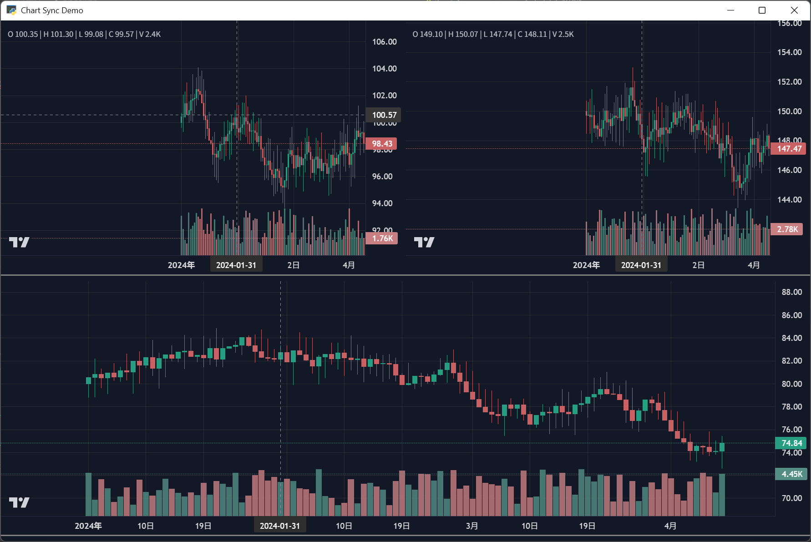

---

### 示例 32：HtmlTabChart（多策略 Tab 切换）

```python
from lightweight_charts import HtmlTabChart

chart = HtmlTabChart(width=1200, height=800)

# 策略1：均线交叉
chart.set_name('均线交叉策略')
chart.set(df1)
chart.set_trades(trades1)
chart.set_performance_metrics(perf1, '均线交叉策略')
chart.set_parameters_list(params1)
chart.new_window()  # 切换到下一个策略

# 策略2：布林带
chart.set_name('布林带策略')
chart.set(df2)
chart.set_trades(trades2)
chart.set_performance_metrics(perf2, '布林带策略')
chart.set_parameters_list(params2)

chart.export('multi_charts.html')
```

**HtmlTabChart 功能：**

| 功能 | 说明 |
|------|------|
| 多策略切换 | 左侧边栏切换不同策略的 K 线图 |
| 技术指标 | 支持 SMA、布林带等指标叠加 |
| 买卖标记 | 开仓/平仓箭头标记 |
| 交易明细 | 表格展示交易记录，双击跳转 |
| 绩效指标 | 夏普比率、最大回撤、胜率等 |
| 策略参数 | 显示每个策略的配置参数 |
| 图例显示 | 左上角显示所有指标名称 |

> 改自 [smalinin/bn_lightweight-charts-python](https://github.com/smalinin/bn_lightweight-charts-python) 的 HtmlChart_BN

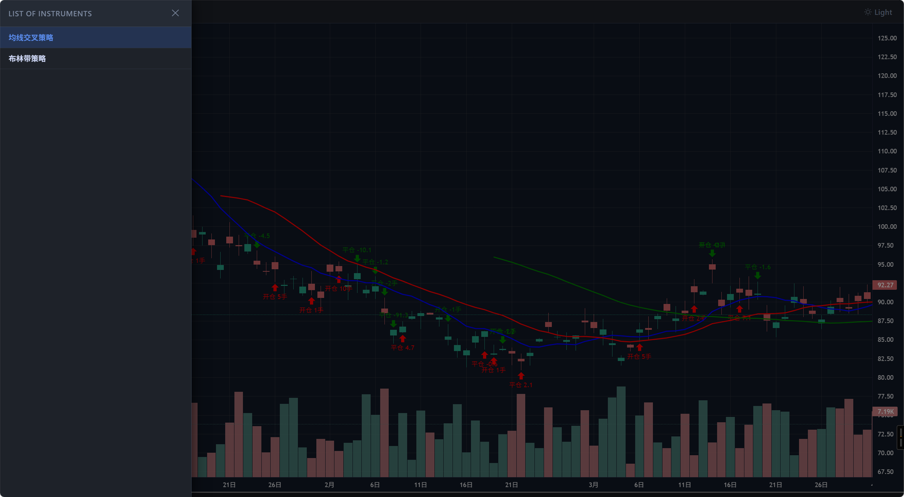

---

### 示例 33：reset_sub（子图内容重置）

```python
from lightweight_charts import Chart

chart = Chart(width=1400, height=900, position=(2,2,1), toolbox=True)
sub_a = chart.create_subchart(position=(2,2,2), toolbox=True, sync_id=chart.id)
sub_b = chart.create_subchart(position=(2,2,3), sync_id=chart.id)
sub_c = chart.create_subchart(position=(2,2,4), toolbox=True)  # 不同步

# 填充数据
chart.set(bars_main); sub_a.set(bars_a); sub_b.set(bars_b); sub_c.set(bars_c)

# reset sub_b → 清除全部内容，保留布局
sub_b.reset_sub()

# 重新填充 → 子图可重用
sub_b.set(new_bars)

# reset 主图 → 也不影响其他子图
chart.reset_sub()
chart.set(new_bars)
```

**reset_sub 功能：**

| 清除范围 | 说明 |
|---------|------|
| K线/成交量/持仓量数据 | `clear_data()` |
| 折线/柱状图系列 | `Line.delete()` / `Histogram.delete()` |
| 价格线 | `PriceLine.delete()` |
| 标记 | `clear_markers()` |
| 绘图 | `Drawing.delete()` |
| 表格 | `Table.delete()` |
| ToolBox | DrawingTool 事件 + ContextMenu + commandFunction + DOM |
| TopBar | Widget 回调 + DOM |
| Legend | crosshair 订阅 + DOM |
| Events | JSEmitter 事件订阅 |
| syncCharts | 双向解关联 + 重建 |
| handlers | 按 salt 匹配清理 |

> reset 后子图可重新填充使用，十字光标和时间轴同步自动恢复


---

### 示例 34：CandleSeries（独立K线系列）

```python
import pandas as pd
from lightweight_charts import Chart

# 主K线
chart = Chart(width=1400, height=900)
chart.set(df_main)

# 参考K线（独立 pane）
ref = chart.create_candle_series(
    name='参考品种',
    pane_index=1,
    up_color='rgba(0, 150, 255, 0.8)',
    down_color='rgba(255, 100, 0, 0.8)',
)
ref.set(df_reference)       # 初始数据
ref.update_bar(new_bar)         # 更新/追加
ref.update_bars(df_more)   # 批量追加
ref.add_marker(...)             # 打标记

chart.show(block=True)
```

**CandleSeries 功能：**

| 功能 | 说明 |
|------|------|
| `create_candle_series()` | 创建独立K线（无 volume/open interest） |
| `set(df)` | 设置初始 OHLC 数据 |
| `update(series)` | 更新最新一根 bar 或追加新 bar |
| `update_bars(df)` | 批量更新多根 bar |
| `add_marker(...)` | 在独立K线上打标记 |
| `delete()` | 删除系列并清理 JS 对象 |
| `pane_index` | 控制绘制在哪个 pane |

> 独立K线适用于参考K线、对比K线等场景，支持与主K线同步十字光标

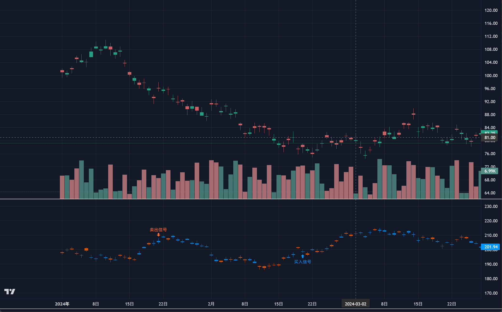

---

### 示例 35：Line / Histogram 系列标记

```python
from lightweight_charts import Chart

chart = Chart(width=1200, height=700, title='Line Series Markers Demo')
chart.set(candle_df)

# 在 Line 上打标记
line20 = chart.create_line('SMA20', color='#2196F3', width=2)
line20.set(sma20)
line20.add_marker(dates[25], 'below', 'circle', '#2196F3', 'SMA20 Cross')

# 在 Histogram 上打标记
hist = chart.create_histogram('Volume', color='rgba(100,100,200,0.5)', pane_index=1)
hist.set(vol_df)
hist.add_marker(dates[5], 'below', 'circle', '#9C27B0', 'Vol Spike')

# 批量打标记
line20.add_markers([
    {'time': dates[35], 'position': 'below', 'shape': 'arrow_up', 'color': '#00BCD4', 'text': 'Batch 1'},
    {'time': dates[45], 'position': 'above', 'shape': 'arrow_down', 'color': '#00BCD4', 'text': 'Batch 2'},
])

chart.show(block=True)
```

**支持标记的系列：**

| 系列 | add_marker() | add_markers() |
|------|----------|-----------|
| CandleSeries（主 K 线） | ✅ | ✅ |
| LineSeries（折线） | ✅ | ✅ |
| HistogramSeries（柱状图） | ✅ | ✅ |
| HistogramSeries（柱状图） | ✅ | ✅ |

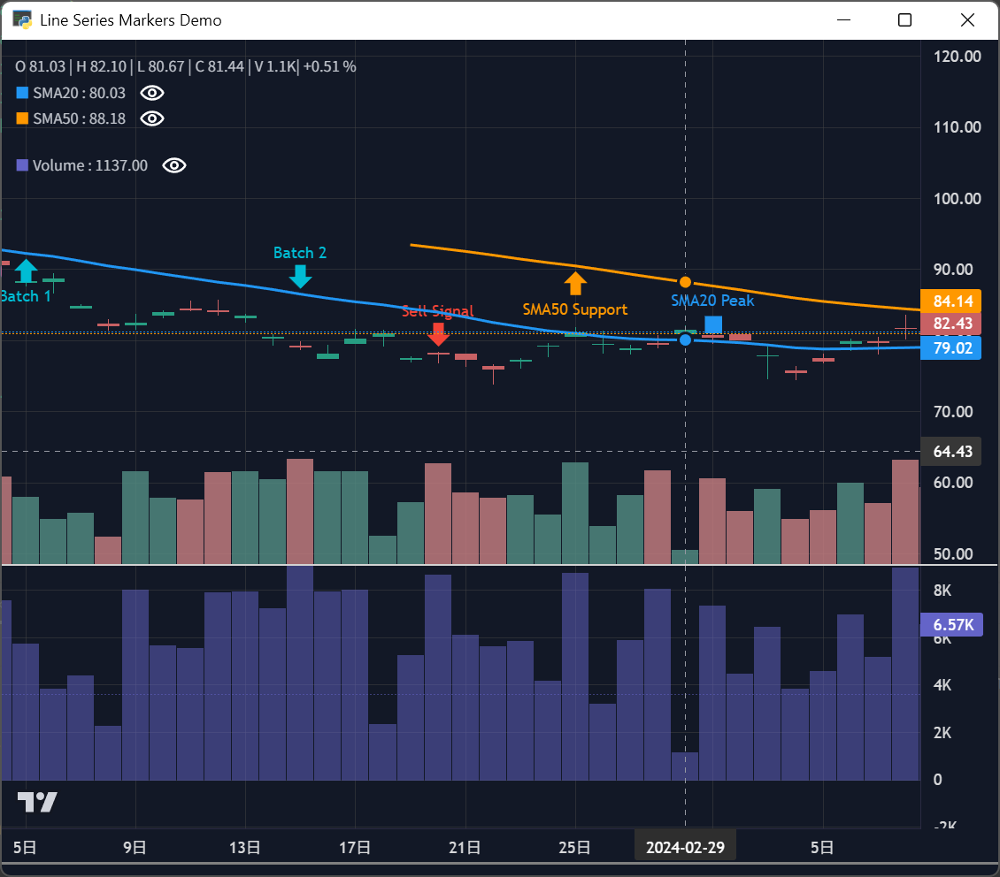

---

### 示例 36：Histogram 任意颜色（per-bar 着色）

```python
from lightweight_charts import Chart

chart = Chart(width=1200, height=700, title='Histogram Custom Colors Demo')
chart.set(candle_df)

# DataFrame 中包含 color 列，每根柱子独立着色
delta_df = pd.DataFrame({
    'time': dates,
    'value': delta,          # 正值=买方强，负值=卖方强
    'color': colors,         # 每根柱子对应一个颜色
})

hist = chart.create_histogram(
    name='Volume Delta',
    color='rgba(100,200,100,0.5)',
    pane_index=1,
)
# 注意：chart.set() 不会转发 color 列，histogram 必须单独 set()
hist.set(delta_df)

chart.show(block=True)
```

**per-bar 着色要点：**

| 要点 | 说明 |
|------|------|
| `color` 列 | DataFrame 中包含 `color` 列即可自动着色 |
| `chart.set()` | 不转发 `color` 列，histogram 必须单独 `set()` |
| 正负值 | 支持正负值双向着色（如 Volume Delta：买方→暖色，卖方→冷色） |

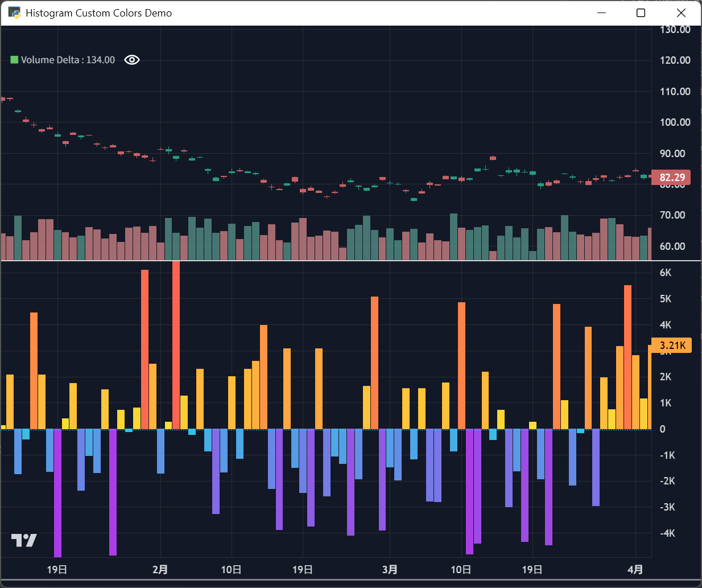

---

### 示例 37：新 Series 类型（Area / OHLC Bar / Baseline）

```python
from lightweight_charts import Chart

chart = Chart(width=1200, height=800, title='New Series Types Demo')
chart.set(df)

# 1. AreaSeries — 面积图（折线+渐变填充）
area = chart.create_area_series(
    name='SMA 20 (Area)',
    color='#2196F3',
    top_color='rgba(33, 150, 243, 0.35)',
    bottom_color='rgba(33, 150, 243, 0.0)',
)
area.set(sma20_df)

# 2. OHLCBarSeries — 美国线（OHLC 横向柱状图）
ohlc_bar = chart.create_ohlc_bar_series(
    name='OHLC Bar',
    up_color='#26A69A',
    down_color='#EF5350',
    pane_index=1,
)
ohlc_bar.set(df)

# 3. BaselineSeries — 基准线（以基准值为界上下分色）
baseline = chart.create_baseline_series(
    name='RSI Deviation',
    baseline_value=0,
    topLineColor='#26A69A',
    bottomLineColor='#EF5350',
    pane_index=2,
)
baseline.set(rsi_df)

chart.show(block=True)
```

**新 Series 类型一览：**

| 类型 | 工厂方法 | 适用场景 |
|------|---------|---------|
| AreaSeries | `create_area_series()` | 面积图：均线、波动率等趋势填充 |
| OHLCBarSeries | `create_ohlc_bar_series()` | 美国线：K 线的另一种画法 |
| BaselineSeries | `create_baseline_series()` | 基准线：RSI 偏差、盈亏等以零轴为界的指标 |
| `legend=False` | 所有系列均支持 | 隐藏辅助系列（背景带、辅助线等）不显示在图例中 |

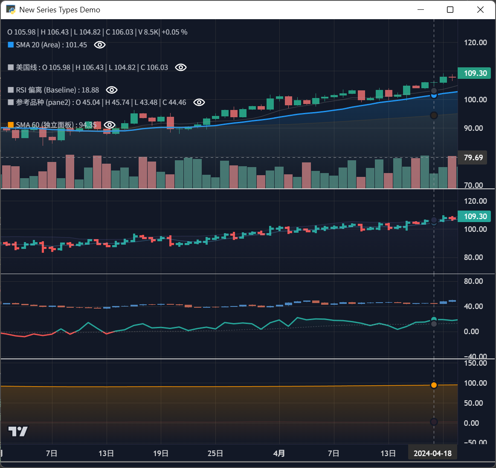

---

### 示例 38：跨 Pane 绘图

```python
from lightweight_charts import Chart

# 3 个 pane 的绘图演示
chart = Chart(width=1200, height=800, title='Drawing Series Multi-Pane', toolbox=True)
chart.legend(visible=True)
chart.set(df)

# Pane 0: K线 + 水平线 + 趋势线 + Box
chart.horizontal_line(price=200, color='orange', width=2, text='均价')
chart.trend_line(start_time, start_price, end_time, end_price, color='#1E80F0')
chart.box(start_time, start_price, end_time, end_price, color='#E91E63')

# Pane 1: 柱状图 + 射线 + 水平线
hist = chart.create_histogram('RSI Dev', pane_index=1)
chart.ray_line(start_time, value=50, color='gray', pane_index=1)
chart.horizontal_line(price=70, color='red', pane_index=1)

# Pane 2: 折线 + 垂直线
sma = chart.create_line('SMA 50', pane_index=2)
chart.vertical_line(time=key_time, color='#FF5722', pane_index=2)

chart.show(block=True)
```

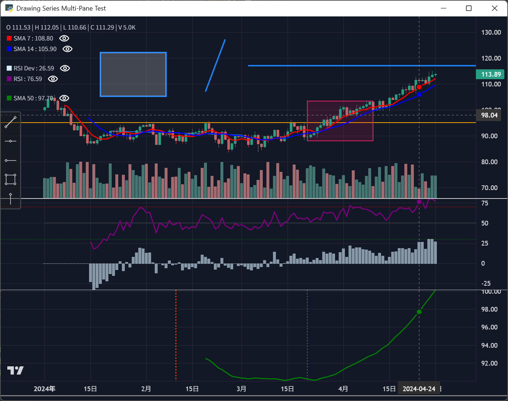

---

### 示例 39：Legend 分组

```python
from lightweight_charts import Chart

chart = Chart()
chart.legend(visible=True, ohlc=True, percent=True, lines=True)
chart.set(df)

# group='MA' 的均线组：同一行显示，♦ MA 组开关一键切换
sma20 = chart.create_line('SMA 20', color='yellow', width=1, group='MA')
ema50 = chart.create_line('EMA 50', color='cyan', width=1, group='MA')

# group='MOM' 的动量组
roc = chart.create_line('ROC 10', color='red', width=1, group='MOM')
mom = chart.create_line('MOM 10', color='green', width=1, group='MOM')

# 无组的独立显示
rsi = chart.create_line('RSI 14', color='purple', pane_index=1)

chart.show(block=True)
```

**Legend 交互：**
- ♦ **组开关**：点击一键切换组内所有 series 可见性
- 👁 **个人眼睛**：切换单个 series，同步更新组开关状态
- 支持跨 pane 同名分组

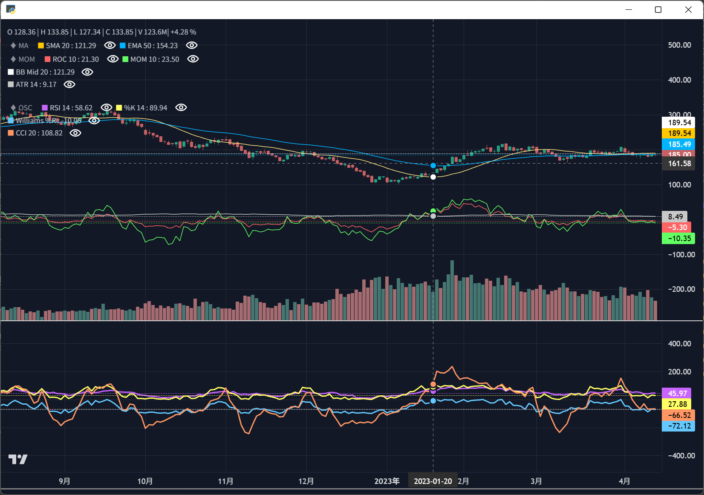

---

### 示例 40：ToolBox 跨 Pane 绘图

```python
from lightweight_charts import Chart
from lightweight_charts.toolbox import DrawingInfo

chart = Chart(width=1200, height=800, title='ToolBox Multi-Pane', toolbox=True)
chart.set(df)

# 创建 3 个 pane
sma = chart.create_line('SMA 7', color='red', pane_index=0)
hist = chart.create_histogram('SMA 20', color='#9B59B6', pane_index=1)
rsi = chart.create_line('RSI', color='#26A69A', pane_index=2)

# 注册绘图变化回调（自动携带 pane_index）
def on_drawings_change(drawings: list[DrawingInfo]):
    for d in drawings:
        print(f'pane={d.pane_index}  type={d.type}  '
              f'time=[{d.start_time}, {d.end_time}]')

chart.toolbox.on_change += on_drawings_change

chart.show(block=True)
```

**ToolBox 跨 Pane 特性：**
- ToolBox UI 固定在 Pane 0
- 鼠标点击哪个 pane 就在哪个 pane 上创建 drawing
- 回调中自动携带 `pane_index` 信息

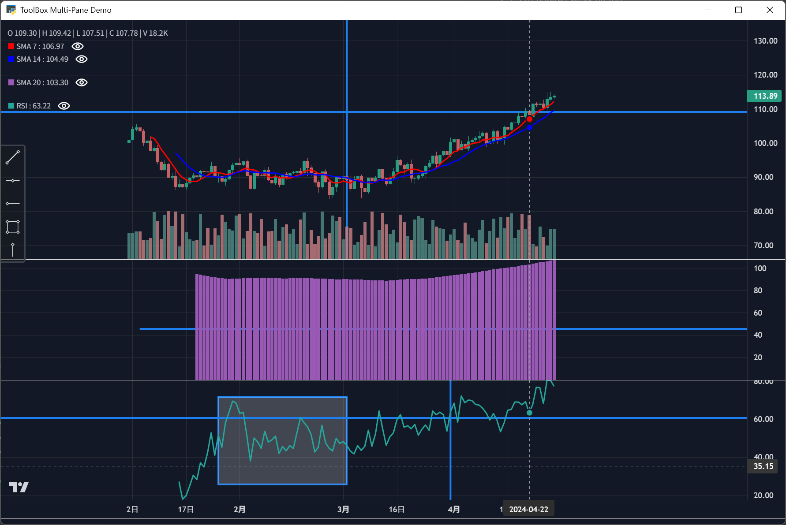

---
